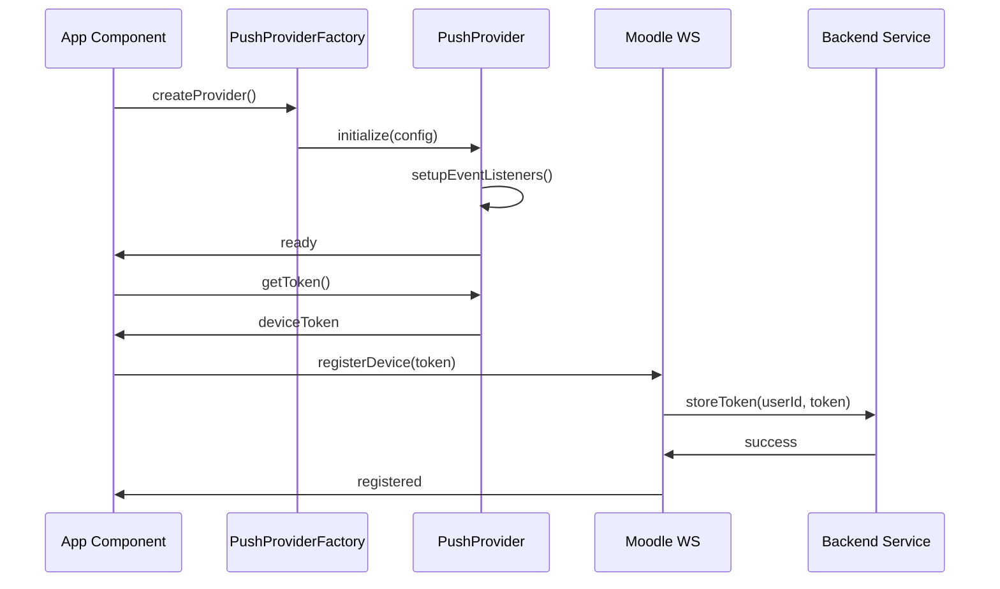
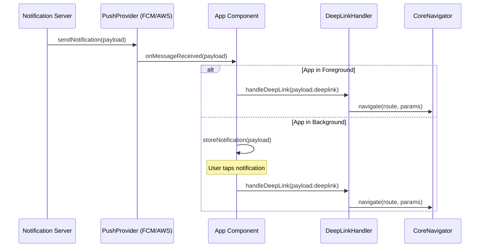
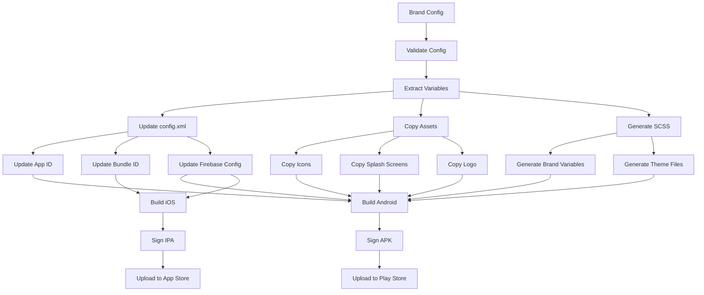

# Moodle Mobile App - White-Labeling & Multi-Provider Push Notifications Context Document

## Table of Contents

1. [Executive Summary](#1-executive-summary)
2. [Codebase Map](#2-codebase-map)
3. [Runtime & Build Configuration](#3-runtime--build-configuration)
4. [Theming & White-Labeling Design](#4-theming--white-labeling-design)
5. [Notifications Architecture (Target)](#5-notifications-architecture-target)
6. [End-to-End Flows (Diagrams)](#6-end-to-end-flows-diagrams)
7. [Backend Contracts](#7-backend-contracts)
8. [Platform Details](#8-platform-details)
9. [Security, Privacy, Compliance](#9-security-privacy-compliance)
10. [Testing Strategy](#10-testing-strategy)
11. [Performance & Reliability](#11-performance--reliability)
12. [Implementation Plan & Effort](#12-implementation-plan--effort)
13. [Open Questions & Assumptions](#13-open-questions--assumptions)
14. [Glossary & References](#14-glossary--references)

---

## 1. Executive Summary

### Architecture Overview
The Moodle Mobile app is built using **Angular 20.3.2** with **Ionic 8.7.5** and **Cordova** for native functionality. It follows a modular architecture with:

- **Core Module**: Base services, utilities, and shared components (`src/core/`)
- **Addons Module**: Feature-specific modules (`src/addons/`)
- **App Module**: Main application shell (`src/app/`)
- **Theme System**: SCSS-based theming with CSS custom properties (`src/theme/`)

### Current Notification Implementation
The app currently uses **Firebase Cloud Messaging (FCM)** via the `@moodlehq/phonegap-plugin-push` plugin:

- **Provider**: `CorePushNotificationsProvider` (`src/core/features/pushnotifications/services/pushnotifications.ts`)
- **Delegate**: `CorePushNotificationsDelegateService` for handling notification clicks
- **Configuration**: Firebase configs in `google-services.json` and `GoogleService-Info.plist`
- **Token Management**: Device registration with Moodle web services via `/webservice/rest/server.php`

### White-Labeling Feasibility
**High feasibility** for white-labeling with the following opportunities:

1. **Configuration-driven branding**: `moodle.config.json` already supports app-level customization
2. **SCSS variable system**: Well-structured theming with `$brand-color` and CSS custom properties
3. **Asset pipeline**: Gulp-based build system can be extended for multi-brand builds
4. **Modular architecture**: Clean separation allows for brand-specific overrides

### Multi-Provider Push Feasibility
**Moderate feasibility** with some refactoring required:

1. **Current limitation**: Tightly coupled to FCM via phonegap-plugin-push
2. **Abstraction needed**: Provider interface to support FCM and AWS SNS/Pinpoint
3. **Token management**: Already abstracts device registration from provider specifics
4. **Payload handling**: Generic notification structure supports multiple providers

### Key Risks & Recommendations

**Risks:**
- Cordova plugin dependencies may limit provider flexibility
- Build complexity increases with multiple brand variants
- Firebase-specific configurations embedded in platform files

**Recommendations:**
- Implement provider abstraction layer before adding AWS support
- Use build-time brand injection rather than runtime configuration
- Create brand-specific Firebase projects for FCM-based brands

---

## 2. Codebase Map

### Repository Structure
```
moodleapp/
├── src/
│   ├── app/                    # Main application shell
│   │   ├── app.component.ts    # Root component with splash handling
│   │   └── app-routing.module.ts # Dynamic route configuration
│   ├── core/                   # Core services and utilities
│   │   ├── services/           # Core services (WS, Sites, Config, etc.)
│   │   ├── features/           # Core features (login, pushnotifications, etc.)
│   │   ├── components/         # Shared UI components
│   │   ├── classes/            # Core classes and utilities
│   │   └── singletons/         # Singleton services
│   ├── addons/                 # Feature modules
│   │   ├── notifications/      # Notification handling
│   │   ├── messages/          # Messaging features
│   │   └── [other modules]/   # Various Moodle features
│   └── theme/                  # Theming system
│       ├── theme.scss          # Main theme entry point
│       ├── globals.variables.scss # SCSS variables
│       ├── theme.light.scss    # Light theme
│       └── theme.dark.scss     # Dark theme
├── config.xml                  # Cordova configuration
├── package.json                # Dependencies and scripts
├── moodle.config.json          # App configuration
├── google-services.json        # Firebase Android config
└── GoogleService-Info.plist   # Firebase iOS config
```

### Key Modules & Services

#### Core Services (`src/core/services/`)
- **`sites.ts`**: Site management, authentication, token handling
- **`ws.ts`**: Moodle web service communication
- **`config.ts`**: Configuration management
- **`local-notifications.ts`**: Local notification handling

#### Push Notifications (`src/core/features/pushnotifications/`)
- **`services/pushnotifications.ts`**: Main push notification service
- **`services/push-delegate.ts`**: Notification click handling
- **`database/pushnotifications.ts`**: Database schemas for tokens and badges

#### Theming System (`src/theme/`)
- **`globals.variables.scss`**: SCSS variables including `$brand-color: #f98012`
- **`theme.light.scss`**: Light theme CSS custom properties
- **`theme.dark.scss`**: Dark theme CSS custom properties
- **`theme.design-system.scss`**: Design system tokens

#### Build System
- **`gulpfile.js`**: Gulp tasks for lang, env, icons
- **`webpack.config.js`**: Webpack configuration with Terser optimization
- **`angular.json`**: Angular build configurations

### Current Notification Handlers
Located in `src/addons/notifications/services/handlers/`:
- **`mainmenu.ts`**: Main menu notification handler
- Various feature-specific handlers for courses, messages, etc.

### Build Identifier Locations
- **App ID**: `config.xml` line 2: `id="com.moodle.moodlemobile"`
- **App Name**: `config.xml` line 3: `<name>Moodle</name>`
- **Version**: `package.json` line 3: `"version": "5.1.0"`
- **Bundle ID**: `GoogleService-Info.plist` line 20: `com.moodle.moodlemobile`

---

## 3. Runtime & Build Configuration

### Current Environment Handling

#### Configuration Files
1. **`moodle.config.json`**: Main configuration (lines 1-140)
2. **`moodle.config.example.json`**: Example configuration
3. **`src/types/config.d.ts`**: TypeScript definitions for config

#### Key Configuration Properties
```typescript
interface EnvironmentConfig {
    app_id: string;                    // "com.moodle.moodlemobile"
    appname: string;                  // "Moodle Mobile"
    versioncode: number;              // 51000
    versionname: string;              // "5.1.0"
    customurlscheme: string;          // "moodlemobile"
    notificoncolor: string;          // "#f98012"
    forceColorScheme: CoreColorScheme;
    forceLoginLogo: boolean;
    showTopLogo: 'online' | 'offline' | 'hidden';
    // ... additional properties
}
```

#### Build Process
1. **Gulp Tasks** (`gulpfile.js`):
   - `lang`: Build language files
   - `env`: Build environment-specific config
   - `icons`: Build icon JSON files
   - `behat`: Build Behat test plugin

2. **Angular Build** (`angular.json`):
   - Development: `ionic build --configuration=development`
   - Production: `ionic build --prod`
   - Testing: `ionic build --configuration=testing`

### Proposed Brand Configuration Schema

#### Brand Config Structure (`brands/{brand-name}/brand.config.json`)
```json
{
  "brand": {
    "id": "university-x",
    "name": "University X Mobile",
    "displayName": "University X",
    "description": "Official mobile app for University X"
  },
  "app": {
    "android": {
      "packageName": "com.universityx.mobile",
      "appId": "com.universityx.mobile"
    },
    "ios": {
      "bundleId": "com.universityx.mobile",
      "appId": "com.universityx.mobile"
    },
    "versionCode": 51000,
    "versionName": "5.1.0"
  },
  "branding": {
    "colors": {
      "primary": "#1e3a8a",
      "secondary": "#3b82f6",
      "accent": "#f59e0b",
      "background": "#ffffff",
      "surface": "#f8fafc"
    },
    "typography": {
      "fontFamily": "Inter, system-ui, sans-serif",
      "fontWeight": {
        "normal": 400,
        "medium": 500,
        "bold": 700
      }
    },
    "assets": {
      "logo": "logo.svg",
      "icon": "icon.png",
      "splash": "splash.png",
      "favicon": "favicon.ico"
    }
  },
  "features": {
    "pushProvider": "fcm", // "fcm" | "aws-sns" | "aws-pinpoint"
    "analytics": true,
    "onboarding": true,
    "darkMode": true
  },
  "endpoints": {
    "moodle": "https://lms.universityx.edu",
    "api": "https://api.universityx.edu",
    "push": "https://push.universityx.edu"
  },
  "deepLinks": {
    "scheme": "universityx",
    "host": "app.universityx.edu"
  }
}
```

### Build-Time Brand Injection Points

#### Android (`config.xml` modifications)
```xml
<!-- Brand-specific app ID -->
<widget id="${BRAND_APP_ID}" version="${BRAND_VERSION}">
    <name>${BRAND_DISPLAY_NAME}</name>

    <!-- Brand-specific Firebase config -->
    <resource-file src="brands/${BRAND_ID}/google-services.json" target="app/google-services.json" />

    <!-- Brand-specific icons -->
    <resource-file src="brands/${BRAND_ID}/icons/drawable-ldpi-icon.png" target="app/src/main/res/mipmap-ldpi/icon.png" />
    <!-- ... other icon sizes -->
</widget>
```

#### iOS (`config.xml` modifications)
```xml
<!-- Brand-specific Firebase config -->
<resource-file src="brands/${BRAND_ID}/GoogleService-Info.plist" />

<!-- Brand-specific bundle ID -->
<edit-config file="*-Info.plist" mode="merge" target="CFBundleIdentifier">
    <string>${BRAND_BUNDLE_ID}</string>
</edit-config>
```

#### Build Script Integration
```bash
# scripts/build-brand.sh
#!/bin/bash
BRAND_ID=$1
BRAND_CONFIG="brands/${BRAND_ID}/brand.config.json"

# Validate brand config
if [ ! -f "$BRAND_CONFIG" ]; then
    echo "Brand config not found: $BRAND_CONFIG"
    exit 1
fi

# Extract brand variables
BRAND_APP_ID=$(jq -r '.app.android.packageName' "$BRAND_CONFIG")
BRAND_DISPLAY_NAME=$(jq -r '.brand.displayName' "$BRAND_CONFIG")
BRAND_VERSION=$(jq -r '.app.versionName' "$BRAND_CONFIG")

# Update config.xml
sed -i "s/\${BRAND_APP_ID}/$BRAND_APP_ID/g" config.xml
sed -i "s/\${BRAND_DISPLAY_NAME}/$BRAND_DISPLAY_NAME/g" config.xml
sed -i "s/\${BRAND_VERSION}/$BRAND_VERSION/g" config.xml

# Build with brand-specific config
ionic cordova build android --prod
```

---

## 4. Theming & White-Labeling Design

### Current Theming System

#### SCSS Variables (`src/theme/globals.variables.scss`)
```scss
// Brand color definition
$brand-color: #f98012 !default;

// Color palette
$primary: $brand-color !default;
$primary-dark: $brand-color !default;

// Text and background colors
$text-color: $gray-900 !default;
$background-color: $white !default;
```

#### CSS Custom Properties (`src/theme/theme.light.scss`)
```scss
:root {
    // Brand colors
    --primary: #{$primary};
    --primary-contrast: #{$primary-contrast};
    --primary-shade: #{$primary-shade};
    --primary-tint: #{$primary-tint};

    // Design system tokens
    --mdl-spacing-0: 0px;
    --mdl-spacing-1: 4px;
    --mdl-typography-fontSize-sm: 12px;
    --mdl-typography-fontSize-md: 14px;
}
```

### Brand Pack Strategy

#### 1. Build-Time Brand Variants
**Approach**: Generate brand-specific SCSS files during build

**Implementation**:
```scss
// brands/{brand-id}/theme/brand.variables.scss
$brand-color: #1e3a8a !default;
$brand-secondary: #3b82f6 !default;
$brand-accent: #f59e0b !default;

// Override default variables
$primary: $brand-color !default;
$secondary: $brand-secondary !default;
```

#### 2. Runtime Theming (Alternative)
**Approach**: Dynamic CSS custom property injection

**Implementation**:
```typescript
// src/core/services/branding.ts
@Injectable({ providedIn: 'root' })
export class CoreBrandingService {
    async loadBrandConfig(brandId: string): Promise<void> {
        const config = await this.loadBrandConfig(brandId);

        // Inject CSS custom properties
        const root = document.documentElement;
        root.style.setProperty('--primary', config.colors.primary);
        root.style.setProperty('--secondary', config.colors.secondary);
        root.style.setProperty('--brand-font-family', config.typography.fontFamily);
    }
}
```

### Asset Replacement Strategy

#### Icon & Splash Screen Pipeline
```bash
# scripts/copy-brand-assets.sh
#!/bin/bash
BRAND_ID=$1
BRAND_DIR="brands/${BRAND_ID}"

# Copy icons
cp "${BRAND_DIR}/icons/"* "resources/android/icon/"
cp "${BRAND_DIR}/icons/"* "resources/ios/"

# Copy splash screens
cp "${BRAND_DIR}/splash/android-splash.xml" "resources/android/"
cp "${BRAND_DIR}/splash/"* "resources/"

# Generate adaptive icons (Android)
# Use ImageMagick or similar tools
```

#### Typography Implementation
```scss
// brands/{brand-id}/theme/typography.scss
:root {
    --ion-font-family: #{map-get($brand-typography, font-family)};
    --mdl-typography-fontWeight-normal: #{map-get($brand-typography, fontWeight-normal)};
    --mdl-typography-fontWeight-medium: #{map-get($brand-typography, fontWeight-medium)};
}
```

### Navigation & Component Styling

#### Header/Footer Customization
```scss
// brands/{brand-id}/theme/components.scss
.core-header-toolbar {
    --background: var(--brand-primary);
    --color: var(--brand-primary-contrast);
}

.core-footer {
    --background: var(--brand-surface);
    --border-color: var(--brand-stroke);
}
```

#### Login Screen Variants
```scss
// brands/{brand-id}/theme/login.scss
.core-login {
    --background: var(--brand-background);
    --text-color: var(--brand-text);

    .login-logo {
        content: url('brands/{brand-id}/assets/logo.svg');
    }
}
```

### Acceptance Criteria

#### Color Contrast Validation
```typescript
// src/core/utils/color-contrast.ts
export class ColorContrastValidator {
    static validate(foreground: string, background: string): boolean {
        const ratio = this.getContrastRatio(foreground, background);
        return ratio >= 4.5; // WCAG AA standard
    }
}
```

#### Icon Size Validation
```typescript
// src/core/utils/asset-validator.ts
export class AssetValidator {
    static validateIconSize(filePath: string, requiredSize: number): boolean {
        // Validate icon dimensions
        return this.getImageDimensions(filePath).width >= requiredSize;
    }
}
```

---

## 5. Notifications Architecture (Target)

### Provider Abstraction Interface

#### Core Interface (`src/core/services/push-provider.interface.ts`)
```typescript
export interface PushProvider {
    readonly name: string;
    readonly platform: 'android' | 'ios' | 'web';

    // Initialization
    initialize(config: PushProviderConfig): Promise<void>;

    // Token management
    getToken(): Promise<string>;
    refreshToken(): Promise<string>;

    // Topic management
    subscribeToTopic(topic: string): Promise<void>;
    unsubscribeFromTopic(topic: string): Promise<void>;

    // Permission handling
    requestPermission(): Promise<PushPermissionStatus>;

    // Event handling
    onMessageReceived(callback: (payload: PushPayload) => void): void;
    onTokenRefresh(callback: (token: string) => void): void;

    // Cleanup
    destroy(): Promise<void>;
}

export interface PushProviderConfig {
    apiKey?: string;
    projectId?: string;
    senderId?: string;
    region?: string;
    endpoint?: string;
}

export interface PushPayload {
    type: 'notification' | 'data' | 'silent';
    title?: string;
    body?: string;
    data?: Record<string, string>;
    deeplink?: string;
    entityId?: string;
    priority?: 'high' | 'normal' | 'low';
    silent?: boolean;
}
```

### Provider Implementations

#### FCM Provider (`src/core/services/providers/fcm-provider.ts`)
```typescript
@Injectable({ providedIn: 'root' })
export class FcmPushProvider implements PushProvider {
    readonly name = 'fcm';
    readonly platform = CorePlatform.getPlatform();

    private pushObject: any;
    private messageCallback?: (payload: PushPayload) => void;
    private tokenCallback?: (token: string) => void;

    async initialize(config: PushProviderConfig): Promise<void> {
        const options = await this.getOptions(config);
        this.pushObject = Push.init(options);

        this.setupEventListeners();
    }

    async getToken(): Promise<string> {
        return new Promise((resolve, reject) => {
            this.pushObject.on('registration', (data: RegistrationEventResponse) => {
                resolve(data.registrationId);
            });

            this.pushObject.on('error', (error: Error) => {
                reject(error);
            });
        });
    }

    private setupEventListeners(): void {
        this.pushObject.on('notification').subscribe((notification: NotificationEventResponse) => {
            const payload = this.transformPayload(notification);
            this.messageCallback?.(payload);
        });

        this.pushObject.on('registration').subscribe((data: RegistrationEventResponse) => {
            this.tokenCallback?.(data.registrationId);
        });
    }

    private transformPayload(notification: NotificationEventResponse): PushPayload {
        return {
            type: notification.additionalData?.type || 'notification',
            title: notification.title,
            body: notification.message,
            data: notification.additionalData,
            deeplink: notification.additionalData?.deeplink,
            entityId: notification.additionalData?.entityId,
            priority: notification.additionalData?.priority || 'normal',
            silent: notification.additionalData?.silent || false,
        };
    }
}
```

#### AWS SNS Provider (`src/core/services/providers/aws-sns-provider.ts`)
```typescript
@Injectable({ providedIn: 'root' })
export class AwsSnsPushProvider implements PushProvider {
    readonly name = 'aws-sns';
    readonly platform = CorePlatform.getPlatform();

    private snsClient: SNSClient;
    private endpointArn?: string;

    async initialize(config: PushProviderConfig): Promise<void> {
        this.snsClient = new SNSClient({
            region: config.region || 'us-east-1',
            credentials: {
                accessKeyId: config.apiKey!,
                secretAccessKey: config.projectId!, // Reusing projectId for secret
            },
        });

        await this.createPlatformEndpoint();
    }

    async getToken(): Promise<string> {
        if (!this.endpointArn) {
            throw new Error('Provider not initialized');
        }
        return this.endpointArn;
    }

    private async createPlatformEndpoint(): Promise<void> {
        const deviceToken = await this.getDeviceToken();

        const command = new CreatePlatformEndpointCommand({
            PlatformApplicationArn: this.getPlatformApplicationArn(),
            Token: deviceToken,
        });

        const response = await this.snsClient.send(command);
        this.endpointArn = response.EndpointArn;
    }

    private getPlatformApplicationArn(): string {
        const platform = CorePlatform.getPlatform();
        const region = this.snsClient.config.region;

        if (platform === 'android') {
            return `arn:aws:sns:${region}:${this.accountId}:app/GCM/${this.appName}`;
        } else if (platform === 'ios') {
            return `arn:aws:sns:${region}:${this.accountId}:app/APNS/${this.appName}`;
        }

        throw new Error(`Unsupported platform: ${platform}`);
    }
}
```

### Provider Selection & Configuration

#### Provider Factory (`src/core/services/push-provider-factory.ts`)
```typescript
@Injectable({ providedIn: 'root' })
export class PushProviderFactory {
    constructor(
        private fcmProvider: FcmPushProvider,
        private awsSnsProvider: AwsSnsPushProvider,
        private config: CoreConfig,
    ) {}

    async createProvider(): Promise<PushProvider> {
        const providerType = await this.config.get('pushProvider', 'fcm');

        switch (providerType) {
            case 'fcm':
                return this.fcmProvider;
            case 'aws-sns':
                return this.awsSnsProvider;
            default:
                throw new Error(`Unknown push provider: ${providerType}`);
        }
    }

    async getProviderConfig(providerType: string): Promise<PushProviderConfig> {
        const config = await this.config.get('pushConfig', {});

        switch (providerType) {
            case 'fcm':
                return {
                    apiKey: config.fcmApiKey,
                    projectId: config.fcmProjectId,
                    senderId: config.fcmSenderId,
                };
            case 'aws-sns':
                return {
                    apiKey: config.awsAccessKeyId,
                    projectId: config.awsSecretAccessKey,
                    region: config.awsRegion,
                    endpoint: config.awsEndpoint,
                };
            default:
                throw new Error(`Unknown provider config: ${providerType}`);
        }
    }
}
```

### Deep Link Routing

#### Deep Link Handler (`src/core/services/deep-link-handler.ts`)
```typescript
@Injectable({ providedIn: 'root' })
export class DeepLinkHandler {
    private routeMap = new Map<string, DeepLinkRoute>();

    constructor(private navigator: CoreNavigator) {
        this.initializeRouteMap();
    }

    async handleDeepLink(deeplink: string, data?: Record<string, string>): Promise<void> {
        const route = this.routeMap.get(deeplink);

        if (!route) {
            this.logger.warn(`Unknown deep link: ${deeplink}`);
            return;
        }

        await this.navigator.navigate(route.path, route.params);
    }

    private initializeRouteMap(): void {
        this.routeMap.set('course', {
            path: '/course/view',
            params: { courseId: 'entityId' }
        });

        this.routeMap.set('message', {
            path: '/messages/conversation',
            params: { conversationId: 'entityId' }
        });

        this.routeMap.set('quiz', {
            path: '/course/module',
            params: { courseId: 'courseId', moduleId: 'entityId' }
        });

        this.routeMap.set('notification', {
            path: '/notifications',
            params: {}
        });
    }
}

interface DeepLinkRoute {
    path: string;
    params: Record<string, string>;
}
```

### Notification Center UI

#### Notification Center Component (`src/core/components/notification-center/`)
```typescript
@Component({
    selector: 'core-notification-center',
    templateUrl: 'notification-center.html',
    styleUrls: ['notification-center.scss']
})
export class CoreNotificationCenterComponent {
    notifications: CoreNotification[] = [];

    constructor(
        private notificationService: CoreNotificationService,
        private deepLinkHandler: DeepLinkHandler,
    ) {}

    async ngOnInit(): Promise<void> {
        this.notifications = await this.notificationService.getNotifications();
    }

    async onNotificationClick(notification: CoreNotification): Promise<void> {
        if (notification.deeplink) {
            await this.deepLinkHandler.handleDeepLink(
                notification.deeplink,
                notification.data
            );
        }

        await this.notificationService.markAsRead(notification.id);
    }
}
```

---

## 6. End-to-End Flows (Diagrams)

### App Startup → Provider Init → Token Registration



### Server Sends Notification → Device Receives → In-App Routing



### Brand-Specific Build Pipeline



---

## 7. Backend Contracts

### Device Token Storage

#### Current Moodle Integration
The app registers device tokens with Moodle using the `core_user_add_user_device` web service:

```typescript
// src/core/features/pushnotifications/services/pushnotifications.ts (lines 642-878)
async registerDeviceOnMoodle(siteId?: string, forceUnregister?: boolean): Promise<void> {
    const site = await CoreSites.getSite(siteId);
    const params = {
        appid: this.getAppId(),
        name: Device.model || 'Unknown',
        model: Device.model || 'Unknown',
        platform: Device.platform || 'Unknown',
        version: Device.version || 'Unknown',
        pushid: this.pushID,
        uuid: Device.uuid || 'Unknown',
    };

    await site.write('core_user_add_user_device', params);
}
```

#### Proposed Enhanced Backend Contract

##### Device Registration Endpoint
```typescript
interface DeviceRegistrationRequest {
    userId: string;
    deviceToken: string;
    platform: 'android' | 'ios' | 'web';
    appVersion: string;
    deviceInfo: {
        model: string;
        osVersion: string;
        language: string;
        timezone: string;
    };
    preferences: {
        topics: string[];
        notificationTypes: string[];
        quietHours?: {
            start: string;
            end: string;
            timezone: string;
        };
    };
}

interface DeviceRegistrationResponse {
    deviceId: string;
    status: 'registered' | 'updated' | 'already_exists';
    expiresAt?: string;
}
```

##### Notification Sending Endpoint
```typescript
interface NotificationRequest {
    userIds: string[];
    topics?: string[];
    payload: {
        type: 'notification' | 'data' | 'silent';
        title?: string;
        body?: string;
        data?: Record<string, string>;
        deeplink?: string;
        entityId?: string;
        priority?: 'high' | 'normal' | 'low';
        silent?: boolean;
    };
    schedule?: {
        sendAt: string;
        timezone: string;
    };
    expiresAt?: string;
}

interface NotificationResponse {
    notificationId: string;
    status: 'queued' | 'sent' | 'failed';
    deviceCount: number;
    errors?: Array<{
        deviceId: string;
        error: string;
    }>;
}
```

### Moodle Web Service Gaps

#### Current Limitations
1. **No topic management**: Cannot subscribe/unsubscribe from topics
2. **No notification preferences**: Limited user preference handling
3. **No batch operations**: Cannot send to multiple users efficiently
4. **No scheduling**: Cannot schedule notifications

#### Proposed Middleware Solution

##### Middleware Endpoints
```typescript
// /api/v1/devices
POST   /api/v1/devices                    // Register device
PUT    /api/v1/devices/{deviceId}         // Update device
DELETE /api/v1/devices/{deviceId}         // Unregister device

// /api/v1/notifications
POST   /api/v1/notifications              // Send notification
GET    /api/v1/notifications/{id}         // Get notification status
POST   /api/v1/notifications/batch        // Send batch notifications

// /api/v1/topics
GET    /api/v1/topics                     // List available topics
POST   /api/v1/topics/{topic}/subscribe   // Subscribe to topic
DELETE /api/v1/topics/{topic}/subscribe   // Unsubscribe from topic

// /api/v1/preferences
GET    /api/v1/preferences                // Get user preferences
PUT    /api/v1/preferences                // Update user preferences
```

##### Middleware Implementation
```typescript
// middleware/src/controllers/notification-controller.ts
export class NotificationController {
    async sendNotification(req: Request, res: Response): Promise<void> {
        const { userIds, topics, payload, schedule } = req.body;

        // Validate payload
        const validation = this.validatePayload(payload);
        if (!validation.valid) {
            res.status(400).json({ error: validation.error });
            return;
        }

        // Get devices
        const devices = await this.deviceService.getDevices(userIds, topics);

        // Send notifications
        const results = await this.pushService.sendToDevices(devices, payload);

        res.json({
            notificationId: generateId(),
            status: 'sent',
            deviceCount: devices.length,
            results,
        });
    }
}
```

---

## 8. Platform Details

### Android Implementation

#### Gradle Configuration
```gradle
// app/build.gradle
android {
    defaultConfig {
        applicationId project.hasProperty('BRAND_APP_ID') ? BRAND_APP_ID : 'com.moodle.moodlemobile'
        versionName project.hasProperty('BRAND_VERSION') ? BRAND_VERSION : '5.1.0'
    }

    buildTypes {
        release {
            minifyEnabled true
            proguardFiles getDefaultProguardFile('proguard-android.txt'), 'proguard-rules.pro'
        }
    }

    flavorDimensions "brand"
    productFlavors {
        moodle {
            dimension "brand"
            applicationId "com.moodle.moodlemobile"
        }
        universityX {
            dimension "brand"
            applicationId "com.universityx.mobile"
        }
    }
}
```

#### Manifest Changes
```xml
<!-- AndroidManifest.xml -->
<manifest xmlns:android="http://schemas.android.com/apk/res/android"
    package="${BRAND_APP_ID}">

    <!-- Push notification permissions -->
    <uses-permission android:name="android.permission.INTERNET" />
    <uses-permission android:name="android.permission.WAKE_LOCK" />
    <uses-permission android:name="android.permission.VIBRATE" />

    <!-- FCM specific -->
    <uses-permission android:name="com.google.android.c2dm.permission.RECEIVE" />
    <permission android:name="${BRAND_APP_ID}.permission.C2D_MESSAGE"
        android:protectionLevel="signature" />
    <uses-permission android:name="${BRAND_APP_ID}.permission.C2D_MESSAGE" />

    <application>
        <!-- Firebase Cloud Messaging Service -->
        <service android:name=".fcm.FirebaseMessagingService"
            android:exported="false">
            <intent-filter>
                <action android:name="com.google.firebase.MESSAGING_EVENT" />
            </intent-filter>
        </service>

        <!-- Notification channels -->
        <meta-data android:name="com.google.firebase.messaging.default_notification_channel_id"
            android:value="default" />
    </application>
</manifest>
```

#### Notification Channels
```typescript
// src/core/services/android/notification-channels.ts
export class AndroidNotificationChannels {
    static async createChannels(): Promise<void> {
        const channels = [
            {
                id: 'default',
                name: 'General',
                description: 'General notifications',
                importance: 'high',
                sound: 'default',
            },
            {
                id: 'course',
                name: 'Course Updates',
                description: 'Course-related notifications',
                importance: 'normal',
                sound: 'default',
            },
            {
                id: 'message',
                name: 'Messages',
                description: 'Direct messages',
                importance: 'high',
                sound: 'default',
            },
        ];

        for (const channel of channels) {
            await this.createChannel(channel);
        }
    }
}
```

### iOS Implementation

#### Info.plist Configuration
```xml
<!-- Info.plist -->
<dict>
    <key>CFBundleIdentifier</key>
    <string>${BRAND_BUNDLE_ID}</string>

    <key>CFBundleDisplayName</key>
    <string>${BRAND_DISPLAY_NAME}</string>

    <!-- Push notification capabilities -->
    <key>UIBackgroundModes</key>
    <array>
        <string>remote-notification</string>
        <string>background-processing</string>
    </array>

    <!-- Notification categories -->
    <key>UNNotificationCategories</key>
    <array>
        <dict>
            <key>identifier</key>
            <string>COURSE_UPDATE</string>
            <key>actions</key>
            <array>
                <dict>
                    <key>identifier</key>
                    <string>VIEW_COURSE</string>
                    <key>title</key>
                    <string>View Course</string>
                </dict>
            </array>
        </dict>
    </array>
</dict>
```

#### APNs Configuration
```typescript
// src/core/services/ios/apns-config.ts
export class ApnsConfig {
    static async requestPermissions(): Promise<boolean> {
        const authOptions: UNAuthorizationOptions = {
            alert: true,
            badge: true,
            sound: true,
        };

        const result = await UNUserNotificationCenter.current().requestAuthorization(authOptions);
        return result;
    }

    static async registerForRemoteNotifications(): Promise<void> {
        await UIApplication.sharedApplication.registerForRemoteNotifications();
    }
}
```

### Web/PWA Implementation

#### Service Worker
```typescript
// src/sw.ts
import { initializeApp } from 'firebase/app';
import { getMessaging, getToken, onMessage } from 'firebase/messaging';

const firebaseConfig = {
    // Brand-specific Firebase config
};

const app = initializeApp(firebaseConfig);
const messaging = getMessaging(app);

// Handle background messages
onMessage(messaging, (payload) => {
    const notificationTitle = payload.notification?.title || 'New notification';
    const notificationOptions = {
        body: payload.notification?.body,
        icon: '/assets/icons/icon-192x192.png',
        badge: '/assets/icons/badge-72x72.png',
        data: payload.data,
    };

    self.registration.showNotification(notificationTitle, notificationOptions);
});

// Handle notification clicks
self.addEventListener('notificationclick', (event) => {
    event.notification.close();

    if (event.notification.data?.deeplink) {
        event.waitUntil(
            clients.openWindow(event.notification.data.deeplink)
        );
    }
});
```

---

## 9. Security, Privacy, Compliance

### Secrets Management

#### Environment-Based Configuration
```typescript
// src/core/services/secrets-manager.ts
@Injectable({ providedIn: 'root' })
export class SecretsManager {
    private secrets: Record<string, string> = {};

    async loadSecrets(): Promise<void> {
        // Load from environment variables or secure storage
        this.secrets = {
            fcmApiKey: process.env.FCM_API_KEY || '',
            awsAccessKeyId: process.env.AWS_ACCESS_KEY_ID || '',
            awsSecretAccessKey: process.env.AWS_SECRET_ACCESS_KEY || '',
        };
    }

    getSecret(key: string): string {
        if (!this.secrets[key]) {
            throw new Error(`Secret not found: ${key}`);
        }
        return this.secrets[key];
    }
}
```

#### Secure Storage for Tokens
```typescript
// src/core/services/secure-storage.ts
@Injectable({ providedIn: 'root' })
export class SecureStorage {
    async storeToken(key: string, token: string): Promise<void> {
        if (CorePlatform.isNative()) {
            await SecureStorage.set(key, token);
        } else {
            // Use encrypted localStorage for web
            const encrypted = await this.encrypt(token);
            localStorage.setItem(key, encrypted);
        }
    }

    async getToken(key: string): Promise<string | null> {
        if (CorePlatform.isNative()) {
            return await SecureStorage.get(key);
        } else {
            const encrypted = localStorage.getItem(key);
            if (!encrypted) return null;
            return await this.decrypt(encrypted);
        }
    }
}
```

### GDPR Compliance

#### Consent Management
```typescript
// src/core/services/consent-manager.ts
@Injectable({ providedIn: 'root' })
export class ConsentManager {
    async requestNotificationConsent(): Promise<boolean> {
        const consent = await this.showConsentDialog({
            title: 'Notification Permissions',
            message: 'We would like to send you notifications about course updates and messages.',
            options: {
                allow: 'Allow Notifications',
                deny: 'Not Now',
                learnMore: 'Learn More',
            },
        });

        if (consent === 'allow') {
            await this.storeConsent('notifications', true);
            return true;
        }

        return false;
    }

    async revokeConsent(type: string): Promise<void> {
        await this.storeConsent(type, false);

        if (type === 'notifications') {
            await this.unregisterDevice();
        }
    }
}
```

#### Data Minimization
```typescript
// src/core/services/data-minimization.ts
export class DataMinimization {
    static sanitizeNotificationPayload(payload: any): any {
        return {
            type: payload.type,
            title: payload.title,
            body: payload.body,
            // Remove any PII
            data: this.removePII(payload.data),
        };
    }

    static removePII(data: Record<string, any>): Record<string, any> {
        const sanitized = { ...data };
        delete sanitized.email;
        delete sanitized.phone;
        delete sanitized.address;
        return sanitized;
    }
}
```

### Logging & Observability

#### PII Redaction
```typescript
// src/core/services/logger.ts
export class CoreLogger {
    private redactPII(message: string): string {
        return message
            .replace(/\b[A-Za-z0-9._%+-]+@[A-Za-z0-9.-]+\.[A-Z|a-z]{2,}\b/g, '[EMAIL]')
            .replace(/\b\d{3}-\d{2}-\d{4}\b/g, '[SSN]')
            .replace(/\b\d{4}[\s-]?\d{4}[\s-]?\d{4}[\s-]?\d{4}\b/g, '[CARD]');
    }

    log(message: string, data?: any): void {
        const sanitizedMessage = this.redactPII(message);
        const sanitizedData = data ? this.redactPII(JSON.stringify(data)) : undefined;

        console.log(sanitizedMessage, sanitizedData);
    }
}
```

---

## 10. Testing Strategy

### Unit Tests

#### Provider Abstraction Tests
```typescript
// src/core/services/providers/__tests__/push-provider.interface.spec.ts
describe('PushProvider Interface', () => {
    let mockProvider: jasmine.SpyObj<PushProvider>;

    beforeEach(() => {
        mockProvider = jasmine.createSpyObj('PushProvider', [
            'initialize', 'getToken', 'subscribeToTopic', 'unsubscribeFromTopic',
            'requestPermission', 'onMessageReceived', 'onTokenRefresh', 'destroy'
        ]);
    });

    it('should initialize with valid config', async () => {
        const config: PushProviderConfig = {
            apiKey: 'test-key',
            projectId: 'test-project',
        };

        await mockProvider.initialize(config);
        expect(mockProvider.initialize).toHaveBeenCalledWith(config);
    });

    it('should handle token refresh', async () => {
        const token = 'new-token';
        mockProvider.onTokenRefresh.and.callFake((callback) => {
            callback(token);
        });

        let receivedToken = '';
        mockProvider.onTokenRefresh((t) => receivedToken = t);

        expect(receivedToken).toBe(token);
    });
});
```

#### Payload Parsing Tests
```typescript
// src/core/services/__tests__/payload-parser.spec.ts
describe('Payload Parser', () => {
    it('should parse FCM payload correctly', () => {
        const fcmPayload = {
            title: 'Test Notification',
            message: 'Test message',
            additionalData: {
                type: 'course',
                entityId: '123',
                deeplink: 'course/123',
            },
        };

        const parsed = PayloadParser.parse(fcmPayload, 'fcm');

        expect(parsed).toEqual({
            type: 'course',
            title: 'Test Notification',
            body: 'Test message',
            entityId: '123',
            deeplink: 'course/123',
            priority: 'normal',
            silent: false,
        });
    });
});
```

### Device/Emulator Tests

#### Foreground Notification Tests
```typescript
// e2e/notifications/foreground.spec.ts
describe('Foreground Notifications', () => {
    it('should display notification when app is in foreground', async () => {
        // Send test notification
        await sendTestNotification({
            title: 'Test Notification',
            body: 'This is a test',
        });

        // Verify notification appears
        const notification = await element(by.id('notification-toast'));
        expect(notification).toBeVisible();

        // Verify notification content
        const title = await element(by.id('notification-title')).getText();
        expect(title).toBe('Test Notification');
    });
});
```

#### Background Notification Tests
```typescript
// e2e/notifications/background.spec.ts
describe('Background Notifications', () => {
    it('should handle notification click when app is in background', async () => {
        // Put app in background
        await device.sendToHome();

        // Send test notification
        await sendTestNotification({
            title: 'Course Update',
            body: 'New assignment posted',
            deeplink: 'course/123',
        });

        // Tap notification
        await device.openNotifications();
        await element(by.text('Course Update')).tap();

        // Verify app opens to correct screen
        await expect(element(by.id('course-view'))).toBeVisible();
    });
});
```

### Snapshot Tests for Branded Themes

#### Theme Snapshot Tests
```typescript
// src/theme/__tests__/brand-snapshots.spec.ts
describe('Brand Theme Snapshots', () => {
    const brands = ['moodle', 'university-x', 'school-y'];

    brands.forEach(brand => {
        it(`should match ${brand} theme snapshot`, async () => {
            await loadBrandTheme(brand);

            const loginPage = await renderComponent(LoginPageComponent);
            expect(loginPage).toMatchSnapshot(`${brand}-login-page`);

            const courseList = await renderComponent(CourseListComponent);
            expect(courseList).toMatchSnapshot(`${brand}-course-list`);
        });
    });
});
```

### Contract Tests for Backend Payloads

#### API Contract Tests
```typescript
// tests/contracts/notification-api.spec.ts
describe('Notification API Contracts', () => {
    it('should accept valid notification request', async () => {
        const request = {
            userIds: ['user123'],
            payload: {
                type: 'notification',
                title: 'Test',
                body: 'Test message',
                deeplink: 'course/123',
            },
        };

        const response = await request(app)
            .post('/api/v1/notifications')
            .send(request)
            .expect(200);

        expect(response.body).toMatchSchema(notificationResponseSchema);
    });

    it('should reject invalid notification request', async () => {
        const request = {
            userIds: [], // Invalid: empty array
            payload: {
                // Missing required fields
            },
        };

        await request(app)
            .post('/api/v1/notifications')
            .send(request)
            .expect(400);
    });
});
```

### CI Recipes for Multi-Brand Builds

#### GitHub Actions Workflow
```yaml
# .github/workflows/build-brands.yml
name: Build Multi-Brand Apps

on:
  push:
    branches: [main]
  pull_request:
    branches: [main]

jobs:
  build-brands:
    runs-on: ubuntu-latest
    strategy:
      matrix:
        brand: [moodle, university-x, school-y]
        platform: [android, ios]

    steps:
      - uses: actions/checkout@v3

      - name: Setup Node.js
        uses: actions/setup-node@v3
        with:
          node-version: '22'

      - name: Install dependencies
        run: npm ci

      - name: Build brand assets
        run: |
          npm run build:brand -- --brand=${{ matrix.brand }}

      - name: Build Android
        if: matrix.platform == 'android'
        run: |
          npm run build:android -- --brand=${{ matrix.brand }}

      - name: Build iOS
        if: matrix.platform == 'ios'
        run: |
          npm run build:ios -- --brand=${{ matrix.brand }}

      - name: Upload artifacts
        uses: actions/upload-artifact@v3
        with:
          name: ${{ matrix.brand }}-${{ matrix.platform }}
          path: dist/
```

---

## 11. Performance & Reliability

### Startup Overhead Analysis

#### Provider Initialization Impact
```typescript
// src/core/services/performance-monitor.ts
@Injectable({ providedIn: 'root' })
export class PerformanceMonitor {
    private metrics: Map<string, number> = new Map();

    async measureProviderInit(provider: PushProvider): Promise<number> {
        const startTime = performance.now();

        try {
            await provider.initialize(await this.getProviderConfig());
            const endTime = performance.now();
            const duration = endTime - startTime;

            this.metrics.set('provider-init', duration);
            return duration;
        } catch (error) {
            this.logger.error('Provider initialization failed', error);
            throw error;
        }
    }

    getMetrics(): Record<string, number> {
        return Object.fromEntries(this.metrics);
    }
}
```

#### Bundle Size Impact
```typescript
// webpack.config.js - Bundle analysis
const BundleAnalyzerPlugin = require('webpack-bundle-analyzer').BundleAnalyzerPlugin;

module.exports = config => {
    if (process.env.ANALYZE_BUNDLE) {
        config.plugins.push(
            new BundleAnalyzerPlugin({
                analyzerMode: 'static',
                openAnalyzer: false,
                reportFilename: 'bundle-analysis.html',
            })
        );
    }

    return config;
};
```

### Lazy Loading Strategy

#### Provider Lazy Loading
```typescript
// src/core/services/push-provider-loader.ts
@Injectable({ providedIn: 'root' })
export class PushProviderLoader {
    private providerCache = new Map<string, PushProvider>();

    async loadProvider(type: string): Promise<PushProvider> {
        if (this.providerCache.has(type)) {
            return this.providerCache.get(type)!;
        }

        let provider: PushProvider;

        switch (type) {
            case 'fcm':
                const { FcmPushProvider } = await import('./providers/fcm-provider');
                provider = new FcmPushProvider();
                break;
            case 'aws-sns':
                const { AwsSnsPushProvider } = await import('./providers/aws-sns-provider');
                provider = new AwsSnsPushProvider();
                break;
            default:
                throw new Error(`Unknown provider type: ${type}`);
        }

        this.providerCache.set(type, provider);
        return provider;
    }
}
```

### Offline Handling

#### Queued Deep Links
```typescript
// src/core/services/offline-queue.ts
@Injectable({ providedIn: 'root' })
export class OfflineQueue {
    private queue: OfflineAction[] = [];

    async queueDeepLink(deeplink: string, data?: Record<string, string>): Promise<void> {
        const action: OfflineAction = {
            type: 'deeplink',
            payload: { deeplink, data },
            timestamp: Date.now(),
            retryCount: 0,
        };

        this.queue.push(action);
        await this.persistQueue();
    }

    async processQueue(): Promise<void> {
        const actions = await this.getQueue();

        for (const action of actions) {
            try {
                await this.executeAction(action);
                await this.removeFromQueue(action);
            } catch (error) {
                await this.handleRetry(action, error);
            }
        }
    }

    private async handleRetry(action: OfflineAction, error: Error): Promise<void> {
        action.retryCount++;

        if (action.retryCount < 3) {
            // Exponential backoff
            const delay = Math.pow(2, action.retryCount) * 1000;
            setTimeout(() => this.processQueue(), delay);
        } else {
            await this.removeFromQueue(action);
            this.logger.error('Action failed after retries', action, error);
        }
    }
}
```

### Crash/ANR Risk Points

#### Critical Path Analysis
```typescript
// src/core/services/crash-monitor.ts
@Injectable({ providedIn: 'root' })
export class CrashMonitor {
    private criticalPaths: Set<string> = new Set([
        'provider-initialization',
        'token-registration',
        'notification-handling',
        'deep-link-processing',
    ]);

    async monitorCriticalPath(path: string, operation: () => Promise<any>): Promise<any> {
        const startTime = performance.now();

        try {
            const result = await operation();
            const duration = performance.now() - startTime;

            if (duration > 5000) { // 5 second threshold
                this.logger.warn(`Slow operation detected: ${path} took ${duration}ms`);
            }

            return result;
        } catch (error) {
            this.logger.error(`Critical path failure: ${path}`, error);
            throw error;
        }
    }
}
```

### Telemetry Hooks

#### Performance Telemetry
```typescript
// src/core/services/telemetry.ts
@Injectable({ providedIn: 'root' })
export class TelemetryService {
    async trackNotificationReceived(payload: PushPayload): Promise<void> {
        const metrics = {
            type: payload.type,
            priority: payload.priority,
            hasDeeplink: !!payload.deeplink,
            timestamp: Date.now(),
        };

        await this.sendMetrics('notification-received', metrics);
    }

    async trackProviderPerformance(provider: string, operation: string, duration: number): Promise<void> {
        const metrics = {
            provider,
            operation,
            duration,
            timestamp: Date.now(),
        };

        await this.sendMetrics('provider-performance', metrics);
    }
}
```

---

## 12. Implementation Plan & Effort

### Phase 1: Code Discovery & Scaffolding (2-3 weeks)

#### Week 1: Architecture Analysis
- **Tasks**:
  - Complete codebase analysis and documentation
  - Identify all notification-related code paths
  - Map current theming system and branding points
  - Document build pipeline and configuration points

- **Deliverables**:
  - Complete Context Document
  - Architecture diagrams
  - Code mapping documentation

- **Effort**: 40 hours

#### Week 2: Provider Abstraction Design
- **Tasks**:
  - Design `PushProvider` interface
  - Create provider factory pattern
  - Design configuration schema
  - Plan migration strategy from current implementation

- **Deliverables**:
  - Provider interface specification
  - Configuration schema
  - Migration plan

- **Effort**: 32 hours

#### Week 3: Brand Configuration System
- **Tasks**:
  - Design brand configuration schema
  - Create brand validation system
  - Design build-time brand injection
  - Plan asset management system

- **Deliverables**:
  - Brand configuration schema
  - Validation system
  - Build pipeline design

- **Effort**: 32 hours

### Phase 2: Provider Abstraction + FCM Baseline (3-4 weeks)

#### Week 4-5: Core Provider Infrastructure
- **Tasks**:
  - Implement `PushProvider` interface
  - Create `PushProviderFactory`
  - Implement configuration management
  - Create payload transformation utilities

- **Deliverables**:
  - Core provider infrastructure
  - Configuration management
  - Payload utilities

- **Effort**: 64 hours

#### Week 6-7: FCM Provider Implementation
- **Tasks**:
  - Refactor existing FCM code to use new interface
  - Implement `FcmPushProvider`
  - Update notification handling
  - Maintain backward compatibility

- **Deliverables**:
  - FCM provider implementation
  - Updated notification handling
  - Backward compatibility

- **Effort**: 56 hours

### Phase 3: AWS Provider Implementation (2-3 weeks)

#### Week 8-9: AWS SNS Provider
- **Tasks**:
  - Implement `AwsSnsPushProvider`
  - Create AWS SDK integration
  - Implement topic management
  - Add error handling and retry logic

- **Deliverables**:
  - AWS SNS provider
  - Topic management
  - Error handling

- **Effort**: 48 hours

#### Week 10: AWS Pinpoint Provider (Optional)
- **Tasks**:
  - Implement `AwsPinpointPushProvider`
  - Add analytics integration
  - Create campaign management
  - Add A/B testing support

- **Deliverables**:
  - AWS Pinpoint provider
  - Analytics integration
  - Campaign management

- **Effort**: 32 hours

### Phase 4: Brand Tokenization & Reference Brands (3-4 weeks)

#### Week 11-12: Brand System Implementation
- **Tasks**:
  - Implement brand configuration system
  - Create brand validation
  - Implement SCSS variable injection
  - Create asset management system

- **Deliverables**:
  - Brand configuration system
  - SCSS injection system
  - Asset management

- **Effort**: 64 hours

#### Week 13-14: Reference Brand Implementation
- **Tasks**:
  - Create "University X" reference brand
  - Create "School Y" reference brand
  - Implement brand-specific assets
  - Test brand switching

- **Deliverables**:
  - Two reference brands
  - Brand-specific assets
  - Brand switching tests

- **Effort**: 48 hours

### Phase 5: Notification Center UI + Deep Links (2-3 weeks)

#### Week 15-16: Notification Center
- **Tasks**:
  - Implement notification center component
  - Add notification history
  - Implement notification preferences
  - Add notification management

- **Deliverables**:
  - Notification center UI
  - Notification history
  - Preferences management

- **Effort**: 48 hours

#### Week 17: Deep Link System
- **Tasks**:
  - Implement deep link handler
  - Create route mapping system
  - Add deep link validation
  - Implement offline queue

- **Deliverables**:
  - Deep link system
  - Route mapping
  - Offline queue

- **Effort**: 32 hours

### Phase 6: CI for Multi-Brand (2 weeks)

#### Week 18-19: CI/CD Pipeline
- **Tasks**:
  - Create multi-brand build pipeline
  - Implement automated testing
  - Add brand validation in CI
  - Create deployment automation

- **Deliverables**:
  - Multi-brand CI pipeline
  - Automated testing
  - Deployment automation

- **Effort**: 48 hours

### Phase 7: QA & Store Readiness (2-3 weeks)

#### Week 20-21: Testing & QA
- **Tasks**:
  - Comprehensive testing of all brands
  - Performance testing
  - Security testing
  - User acceptance testing

- **Deliverables**:
  - Test results
  - Performance benchmarks
  - Security audit

- **Effort**: 48 hours

#### Week 22: Store Preparation
- **Tasks**:
  - Prepare store listings
  - Create brand-specific screenshots
  - Prepare app store metadata
  - Final testing and validation

- **Deliverables**:
  - Store listings
  - Screenshots
  - Metadata

- **Effort**: 32 hours

### Total Effort Estimate

| Phase | Duration | Effort (Hours) | Effort (Person-Weeks) |
|-------|----------|----------------|----------------------|
| Phase 1 | 3 weeks | 104 | 2.6 |
| Phase 2 | 4 weeks | 120 | 3.0 |
| Phase 3 | 3 weeks | 80 | 2.0 |
| Phase 4 | 4 weeks | 112 | 2.8 |
| Phase 5 | 3 weeks | 80 | 2.0 |
| Phase 6 | 2 weeks | 48 | 1.2 |
| Phase 7 | 3 weeks | 80 | 2.0 |
| **Total** | **22 weeks** | **624 hours** | **15.6 person-weeks** |

### Dependencies & Risks

#### Dependencies
1. **Firebase Project Setup**: Each brand needs its own Firebase project
2. **AWS Account Setup**: AWS SNS/Pinpoint configuration for AWS-based brands
3. **App Store Accounts**: Separate developer accounts for each brand
4. **Design Assets**: Brand-specific logos, icons, and splash screens

#### Risks
1. **Cordova Plugin Limitations**: May restrict provider flexibility
2. **Build Complexity**: Multi-brand builds may become complex
3. **Store Approval**: Brand-specific apps may face different approval processes
4. **Maintenance Overhead**: Multiple brands increase maintenance complexity

#### Mitigation Strategies
1. **Provider Abstraction**: Design flexible provider interface
2. **Automated Testing**: Comprehensive test coverage for all brands
3. **Documentation**: Clear documentation for brand creation process
4. **Monitoring**: Implement monitoring for all brand variants

---

## 13. Open Questions & Assumptions

### Technical Questions

#### 1. Cordova Plugin Compatibility
**Question**: Can we use multiple push notification plugins simultaneously, or do we need to choose one provider per build?

**Assumption**: We'll implement a single plugin abstraction that can be configured for different providers at build time.

**Decision Needed**: Whether to use a single plugin with provider switching or multiple plugins with runtime selection.

#### 2. Firebase Project Management
**Question**: How should we handle Firebase project creation and management for multiple brands?

**Assumption**: Each brand will have its own Firebase project with separate configuration files.

**Decision Needed**: Whether to automate Firebase project creation or require manual setup.

#### 3. AWS Service Selection
**Question**: Should we use AWS SNS or AWS Pinpoint for push notifications?

**Assumption**: AWS SNS for basic push notifications, AWS Pinpoint for advanced features like analytics and campaigns.

**Decision Needed**: Final decision on AWS service based on feature requirements.

#### 4. Build-Time vs Runtime Branding
**Question**: Should brand configuration be injected at build time or loaded at runtime?

**Assumption**: Build-time injection for better performance and security.

**Decision Needed**: Final decision based on performance requirements and security considerations.

### Business Questions

#### 1. Brand Approval Process
**Question**: How will new brands be approved and added to the system?

**Assumption**: Brands will be added through a configuration process with validation.

**Decision Needed**: Define the brand approval workflow and requirements.

#### 2. Pricing Model
**Question**: How will the white-labeling feature be priced?

**Assumption**: Per-brand licensing with additional costs for custom features.

**Decision Needed**: Define pricing structure and licensing model.

#### 3. Support Model
**Question**: How will support be provided for multiple brand variants?

**Assumption**: Centralized support with brand-specific documentation.

**Decision Needed**: Define support structure and documentation requirements.

### Technical Assumptions

#### 1. Moodle Compatibility
**Assumption**: The current Moodle web service integration will work with the new notification system.

**Validation Needed**: Test with different Moodle versions and configurations.

#### 2. Platform Support
**Assumption**: The solution will work on Android, iOS, and web platforms.

**Validation Needed**: Test on all target platforms.

#### 3. Performance Impact
**Assumption**: The provider abstraction will not significantly impact app performance.

**Validation Needed**: Performance testing with different providers.

#### 4. Security Requirements
**Assumption**: The current security model will be sufficient for multi-brand deployment.

**Validation Needed**: Security audit of the new architecture.

### Open Decisions

#### 1. Provider Selection Strategy
- **Option A**: Single provider per build (simpler, better performance)
- **Option B**: Runtime provider selection (more flexible, potential performance impact)

#### 2. Brand Configuration Storage
- **Option A**: Build-time injection (better security, requires rebuild for changes)
- **Option B**: Runtime configuration (more flexible, potential security concerns)

#### 3. Notification Payload Format
- **Option A**: Provider-specific payloads (better performance, less flexible)
- **Option B**: Universal payload format (more flexible, potential performance impact)

#### 4. Error Handling Strategy
- **Option A**: Fail-fast approach (better debugging, potential user impact)
- **Option B**: Graceful degradation (better user experience, harder debugging)

---

## 14. Glossary & References

### Key Terms

#### Brand Pack
A collection of assets, configurations, and customizations that define a specific brand variant of the Moodle Mobile app. Includes logos, colors, fonts, app identifiers, and feature configurations.

#### Design Tokens
Named entities that store visual design attributes such as colors, typography, spacing, and other design elements. Used to maintain consistency across different brand variants.

#### Deep Link
A URL scheme that allows the app to navigate to specific screens or content when opened from external sources such as notifications, web links, or other apps.

#### Topic
A subscription mechanism in push notification systems that allows users to receive notifications about specific subjects or categories (e.g., course updates, messages, announcements).

#### Push Provider
An abstraction layer that handles communication with different push notification services (FCM, AWS SNS, AWS Pinpoint) while providing a unified interface for the application.

#### White-Labeling
The process of customizing an application with different branding, colors, logos, and configurations to create multiple variants for different clients or organizations.

### File References

#### Core Files
- **`src/app/app.component.ts`**: Main application component with splash screen handling
- **`src/core/services/sites.ts`**: Site management and authentication
- **`src/core/services/ws.ts`**: Moodle web service communication
- **`src/core/features/pushnotifications/services/pushnotifications.ts`**: Current push notification implementation
- **`src/theme/globals.variables.scss`**: SCSS variables and brand colors
- **`config.xml`**: Cordova configuration with app identifiers
- **`moodle.config.json`**: Application configuration
- **`package.json`**: Dependencies and build scripts

#### Configuration Files
- **`google-services.json`**: Firebase Android configuration
- **`GoogleService-Info.plist`**: Firebase iOS configuration
- **`angular.json`**: Angular build configurations
- **`webpack.config.js`**: Webpack configuration with optimization
- **`gulpfile.js`**: Gulp tasks for build pipeline

#### Theming Files
- **`src/theme/theme.scss`**: Main theme entry point
- **`src/theme/theme.light.scss`**: Light theme CSS custom properties
- **`src/theme/theme.dark.scss`**: Dark theme CSS custom properties
- **`src/theme/theme.design-system.scss`**: Design system tokens

#### Build Files
- **`scripts/build-brand.sh`**: Brand-specific build script
- **`scripts/copy-brand-assets.sh`**: Asset copying script
- **`gulp/task-build-env.js`**: Environment build task
- **`gulp/task-build-icons-json.js`**: Icon build task

### External References

#### Documentation
- [Ionic Framework Documentation](https://ionicframework.com/docs)
- [Angular Documentation](https://angular.io/docs)
- [Cordova Plugin Development](https://cordova.apache.org/docs/en/latest/guide/hybrid/plugins/)
- [Firebase Cloud Messaging](https://firebase.google.com/docs/cloud-messaging)
- [AWS SNS Documentation](https://docs.aws.amazon.com/sns/)
- [AWS Pinpoint Documentation](https://docs.aws.amazon.com/pinpoint/)

#### Standards
- [WCAG 2.1 Accessibility Guidelines](https://www.w3.org/WAI/WCAG21/quickref/)
- [Material Design Guidelines](https://material.io/design)
- [iOS Human Interface Guidelines](https://developer.apple.com/design/human-interface-guidelines/)
- [Android Design Guidelines](https://developer.android.com/design)

#### Tools
- [Webpack Bundle Analyzer](https://github.com/webpack-contrib/webpack-bundle-analyzer)
- [Jest Testing Framework](https://jestjs.io/)
- [Cypress E2E Testing](https://www.cypress.io/)
- [ESLint Code Quality](https://eslint.org/)

### Code Examples

#### Provider Interface Implementation
```typescript
// Example of how to implement a new push provider
export class CustomPushProvider implements PushProvider {
    readonly name = 'custom';
    readonly platform = CorePlatform.getPlatform();

    async initialize(config: PushProviderConfig): Promise<void> {
        // Initialize custom push service
    }

    async getToken(): Promise<string> {
        // Get device token from custom service
    }

    // ... implement other interface methods
}
```

#### Brand Configuration Example
```json
{
  "brand": {
    "id": "example-university",
    "name": "Example University Mobile",
    "displayName": "Example University"
  },
  "app": {
    "android": {
      "packageName": "com.exampleuniversity.mobile"
    },
    "ios": {
      "bundleId": "com.exampleuniversity.mobile"
    }
  },
  "branding": {
    "colors": {
      "primary": "#1e3a8a",
      "secondary": "#3b82f6"
    }
  },
  "features": {
    "pushProvider": "fcm"
  }
}
```

#### Deep Link Handling Example
```typescript
// Example of handling a deep link
const deepLinkHandler = new DeepLinkHandler();

// Handle course deep link
await deepLinkHandler.handleDeepLink('course', { entityId: '123' });
// Navigates to: /course/view?courseId=123

// Handle message deep link
await deepLinkHandler.handleDeepLink('message', { entityId: '456' });
// Navigates to: /messages/conversation?conversationId=456
```

---

*This Context Document provides a comprehensive analysis of the Moodle Mobile app codebase and outlines a detailed plan for implementing white-labeling and multi-provider push notifications. The document serves as a technical reference for developers and stakeholders involved in the implementation process.*
